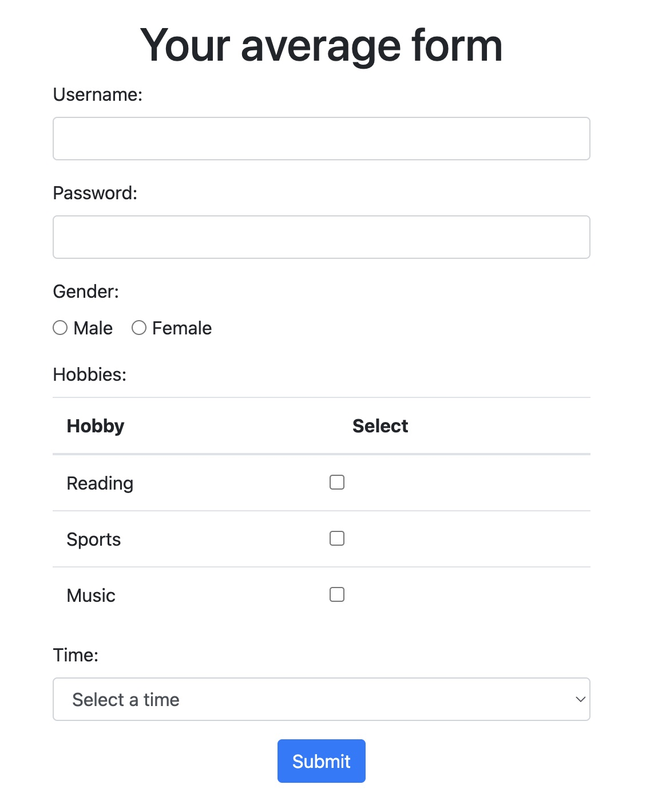

# Requirements:
NodeJS 18.12  

# Installation  
`npm install`

# Start a server  
`npm run serve`

# To run tests  
`npm run test`

# Assignment  
Congratulations! You just got hired to your first unicorn startup company.  
Your new company just finished developing the latest feature called "Your average form".  
  
Your task is to to cover "Your average form" with automated tests using [Cypress.io](https://cypress.io),  
or any other testing framework of your choice.  
Here's a general TODO list:
- explore "Your average form" webpage
- create testing scenarios
- create tests for those scenarios

Although the assignment is small, it doesn't mean your code quality can be poor.  
Make sure to format your code properly and use the page object pattern.  

Good luck and have fun!